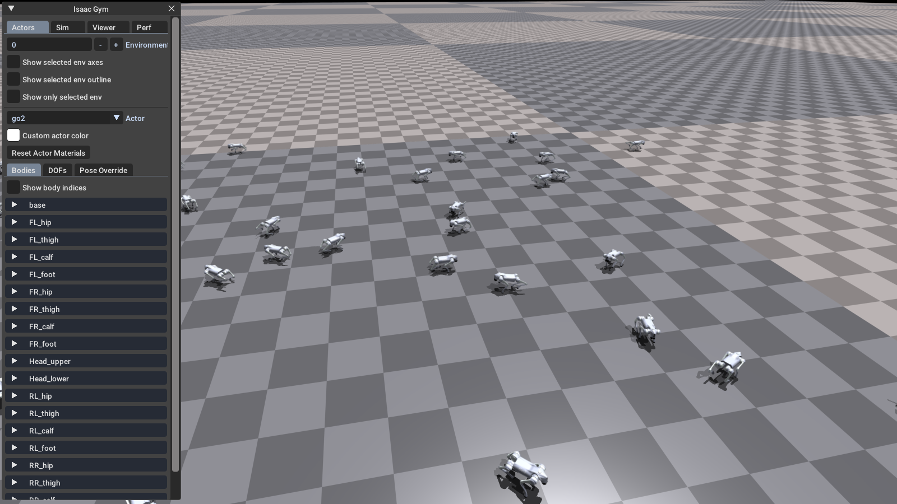
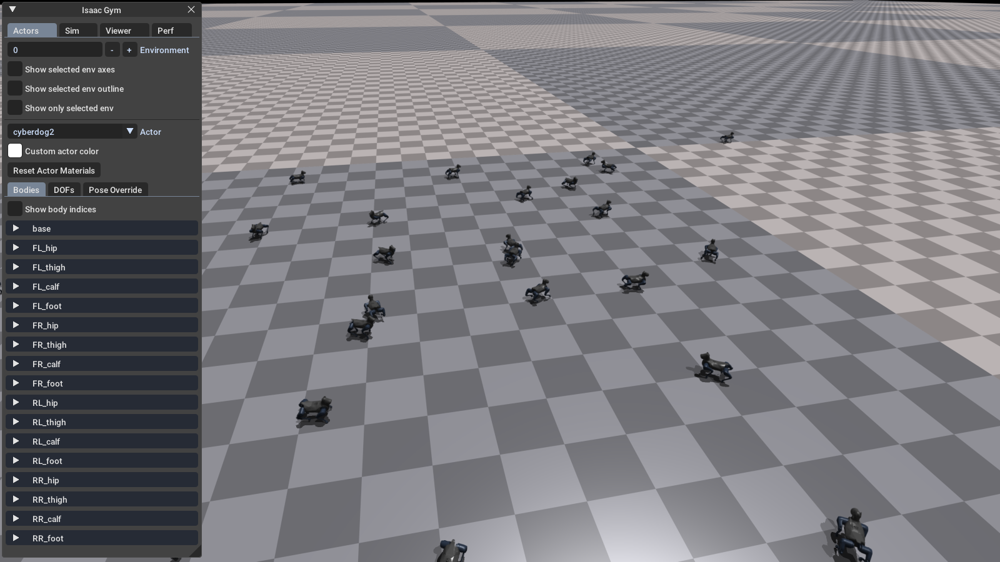

<div align="center">
    <h1 align="center">Quadruped Trot</h1>
</div>
trot for go2 edu and Xiaomi cyberdog2

| <div align="center"> Isaac Gym </div> | <div align="center"> Mujoco </div> |
|--- | --- |
|   |  
</div>

**reference code:** [walk-these-ways](https://github.com/Improbable-AI/walk-these-ways.git) , [walk-these-ways-go2](https://github.com/Teddy-Liao/walk-these-ways-go2.git) , [My_unitree_go2_gym](https://github.com/yusongmin1/My_unitree_go2_gym.git)

**reference paper:**  [Walk These Ways: Tuning Robot Control for Generalization with Multiplicity of Behavior](https://gmargo11.github.io/walk-these-ways/)

### Installation ###
1. Create a new python virtual env with python 3.8
```bash
conda create -n trot python=3.8
```
2. activate conda env
```bash
conda activate trot
```
3. Install pytorch:
```bash
pip3 install torch torchvision --index-url https://download.pytorch.org/whl/cu126
```
4. Install Isaac Gym
- Download and install Isaac Gym from https://developer.nvidia.com/isaac-gym
```bash
cd isaacgym/python && pip install -e .
```
- Try running an example `cd examples && python 1080_balls_of_solitude.py`
- For troubleshooting check docs `isaacgym/docs/index.html`
4. Install rsl_rl
```bash
cd rsl_rl && pip install -e .
``` 
5. clone this repository
```bash
git clone https://github.com/ak1raljl/amp_go2.git
cd legged_gym && pip install -e .
```

### Train ###

```bash
python legged_gym/legged_gym/scripts/train.py --task=go2_walk_these_ways
```


### Play ###
```bash
python legged_gym/legged_gym/scripts/play.py --task=go2_walk_these_ways
```

### Sim2Sim ###

This repository provides Isaac Gym policy replay in MuJoCo through `deploy_mujoco/deploy_go2.py`.

1. Install additional dependencies:

```bash
pip install mujoco pygame pyyaml imageio
```

2. Make sure the TorchScript policy exists. The easiest way is to run `play.py` once after training, which will export:

```bash
legged_gym/logs/go2_walk_these_ways/exported/policies/policy_1.pt
```

3. Run MuJoCo Sim2Sim from the repository root:

```bash
python sim2sim/deploy_go2.py
```

- Keyboard control:
  - `W / S`: forward / backward
  - `A / D`: left / right
  - `Q / E`: yaw left / yaw right

- `go2.yaml` should stay consistent with the training config, especially `num_obs`, `action_scale`, `kps`, `kds`, `default_angles`, and joint order. If these values do not match the Isaac Gym side, MuJoCo replay will behave incorrectly.

### GO2 Sim2Real ###
refer to my sim2real repository [go2_sim2sim_deploy](https://github.com/ak1raljl/go2_sim2sim_deploy)
